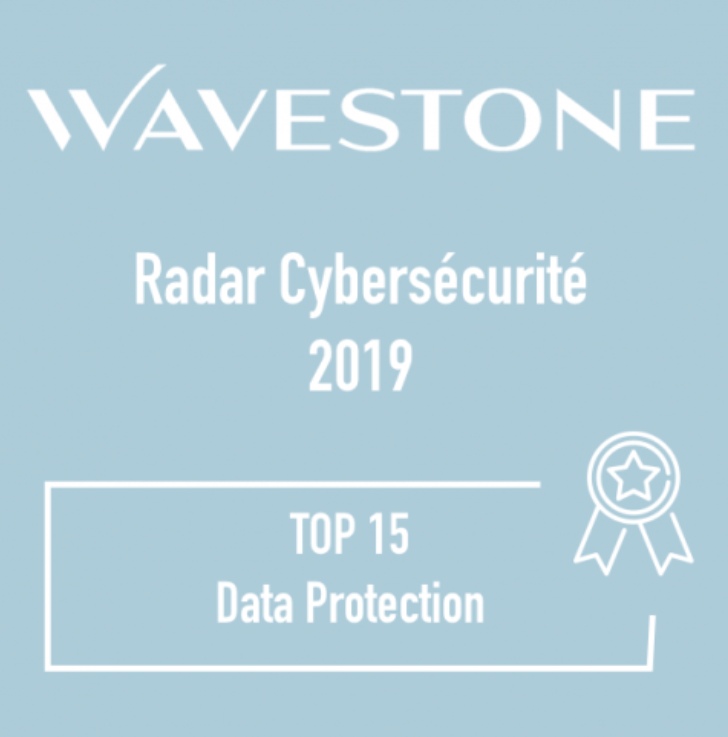

# Ugloo est dans le top 15 des startups 🇫🇷 de data protection

{ .col-md-4 .img-fluid .d-flex .mx-auto .align-items-center .rounded .p1 }

> Depuis 2019 et <u>pour la 5e année consécutive</u>, **Ugloo** est présente dans le **top 15** des solutions de data protection,  
> dans le **CyberSecurity Innovation Radar** publié par **WaveStone** et **BPIFrance** et regroupant +160 _startups_ françaises.

{ .col-md-10 .img-fluid .d-flex .mx-auto .align-items-center .rounded .p1 }

Retrouvez l'article complet sur [le site de WaveStone](https://www.wavestone.com/fr/insight/radar-startups-cybersecurite-france-2023/).
