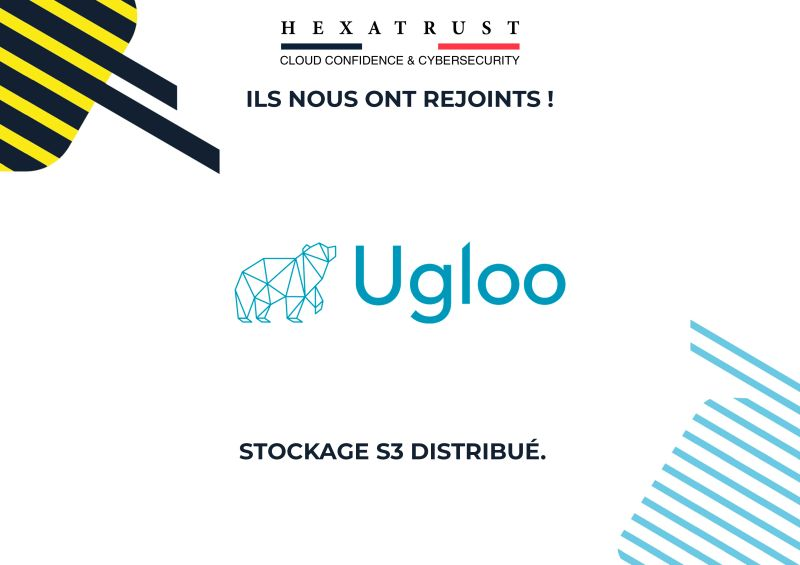

# Ugloo rejoint Hexatrust

{ .col-md-8 .img-fluid .d-flex .mx-auto .align-items-center .rounded .p1 .mb-4 }

📣 Toute l’équipe **Ugloo** est très heureuse de rejoindre l’association **Hexatrust**. 🙌  
Nous recherchons à partager et échanger notre #expérience avec les autres adhérents de l’association.  
Nous voulons booster la reconnaissance de notre logiciel sur le marché de la **cybersécurité** dans la rubrique **protection de données** mais aussi des **Cloud Service Providers** qui recherchent une solution de stockage `S3` distribué **souveraine**.
