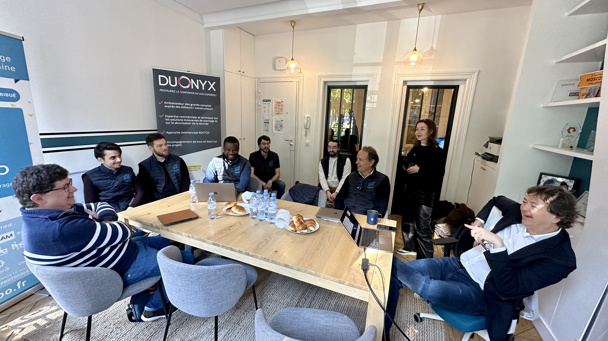

# Présentation des nouvelles fonctionnalités et de la roadmap 2024

{ .col-md-8 .img-fluid .d-flex .mx-auto .align-items-center .rounded .p1 .mb-4 }

> 💡 Pour une fois, c’est une partie de l’équipe **Ugloo** qui est descendue à Paris.  
> Encore un bon moment passé ensemble et une journée très instructive 🙂

Une très grande partie de l'équipe **Ugloo** a fait le déplacement, en cette fin avril, jusque dans les locaux parisiens de l'esplanade des Invalides.  
Au-delà de l'agréable moment partagé avec ses pairs, spécialistes des solutions de stockage, d'archivage et de _containers_, c'était surtout l'occasion, pour l'équipe **Ugloo**, de présenter en détail les dernières fonctionnalités de sa solution de stockage `S3` distribué :

1. une observabilité renforcée et orientée _CSP_ avec l'intégration de **métriques [Prometheus](https://prometheus.io/)**.
2. **_multi-tenancy_** et **_service accounts_**
3. **réplication de _buckets_ entre 2 _clusters_** en synchrone ou en asynchrone
4. **géocluster** avec plusieurs niveaux d'anti-affinité de localisation
5. **chiffrement TLS en transit** sur tout le _cluster_
6. chiffrement côté serveur et **intégration des principales _KMS_** du marché

Un panel de clients, de représentants d'éditeurs et d'intégrateurs assistaient à cette démonstration.  
Leur retour est unanime : **Ugloo** n'a absolument pas à rougir face à une <u>concurrence moins innovante</u> à bien des égards.  

La _roadmap_ à venir est tout aussi enthousiasmante, avec une super fonctionnalité : la **redistribution des données transparente** et à consommation de ressources minimale en cas d'extension du _cluster_ **Ugloo**.

Retrouvez les _posts_ sur **LinkedIn**.

https://www.linkedin.com/feed/update/urn:li:activity:7189301427800854528/  
https://www.linkedin.com/posts/lpiot_pour-une-fois-cest-une-partie-de-l%C3%A9quipe-activity-7189604785308794881-wHAB/