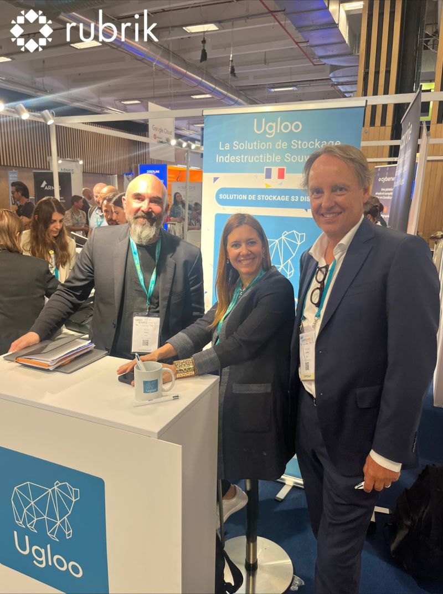

# Ugloo et Rubrik avec HexaTrust à SantExpo 2024

{ .col-md-6 .img-fluid .d-flex .mx-auto .align-items-center .rounded .p1 .mb-4 }

`Ugloo` et **Rubrik** ensemble avec **[HEXATRUST](https://www.hexatrust.com/)** pour 3 journées intenses à **[SantExpo](https://www.santexpo.com/salon-santexpo/)**, Porte de Versailles, pour vous présenter la proposition de valeur autour de la cyber résilience :

- [Rubrik](https://www.rubrik.com/) : la solution de Cyber Résilience 
- Ugloo 🇫🇷: le stockage indestructible
