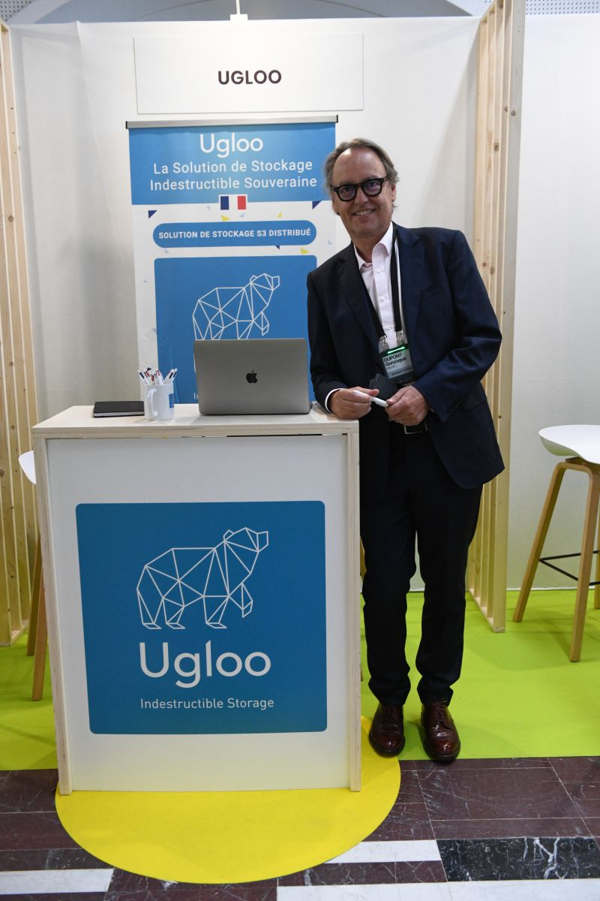

# 📣 Ugloo présent aux Universités du CRIP 2024 !

{ .col-md-6 .img-fluid .d-flex .mx-auto .align-items-center .rounded .p1 .mb-4 }

Les 📆 12 et 13 juin, Gonzague Dupont et son équipe réprésentaient `Ugloo` lors des **Universités du CRIP 2024**.

💡 Un très bon moment, 2 jours exceptionnels, et surtout une bienveillance de ses membres. 🔦
