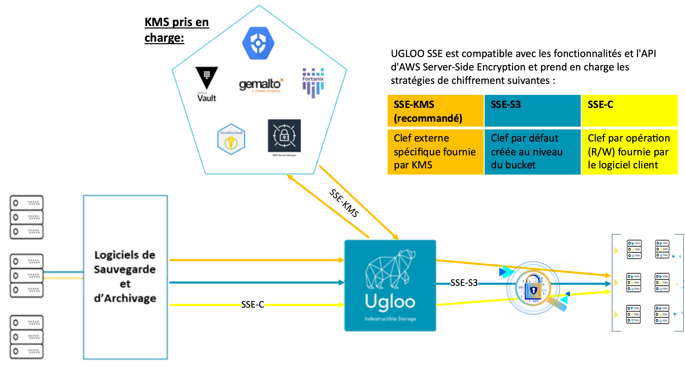

.
{ .img-fluid }

> `Ugloo` a l'ambition de vous proposer un **stockage indestructible**  
> résilient, multi-sites, chiffré, décentralisé et immuable.

# Chiffrement des données

`Ugloo` implémente le chiffrement de données à l'état de l'art.

## Chiffrement en transit

<!-- FIX: bug sur les sauts de lignes des puces -->
* Connexion _TLS_ entre le client et la passerelle `S3`.
  * Utilisation de certificat autosigné ou fourni par le client.

## Chiffrement _at-rest_ et en transit au sein du _cluster_

Les données sont chiffrées à l'écriture sur le _cluster_.  
`UGLOO SSE` est compatible avec les fonctionnalités et l'_API_ d'**AWS** `Server-Side Encryption` et prend en charge les stratégies de chiffrement suivantes :
* `SSE-KMS`, où la clé spécifique est fournie par une _KMS_
  * disponibilité d'une _PKI_ interne à votre instance `Ugloo`
  * possibilité de recourir à votre gestionnaire de clés de chiffrement favori
    * HashiCorp Vault
    * Azure Key Vault, AWS Key Secure Manager, Google Cloud KMS
    * Fortanix Data Security Manager
    * Gemalto SafeNet KeySecure
* `SSE-S3`, où une clé par défaut est attribuée au chiffrement de chaque bucket
* `SSE-SC`, où la clé est fournie par le client à chaque opération de lecture/écriture d'un objet.

.

# Double immutabilité

Les _ransomwares_ par _cryptolocking_ n'ont pas de prise sur la donnée stockée dans `Ugloo`. Chaque version d'un objet présente une double immuabilité :
* au niveau de la configuration de l'objet `S3` à travers [les modes de _lock_ et les délais de rétention.](#gestion-de-versions-et-cycle-de-vie)
* au niveau des fragments `DeepTorrent`, qui sont nativement immuables
  * avec délai de rétention réglementaire configurable
  * et corbeille récupérable 

# Protocole BitTorrent audité

`Ugloo` s'appuie sur la bibliothèque _open source_ [libtorrent](https://www.libtorrent.org/), qui a subit un [audit de sécurité, fin 2020](https://www.libtorrent.org/security-audit.html), commandité par [Mozilla Open Source Support Awards](https://www.mozilla.org/en-US/moss/) et mené par [include security](https://IncludeSecurity.com/).

.