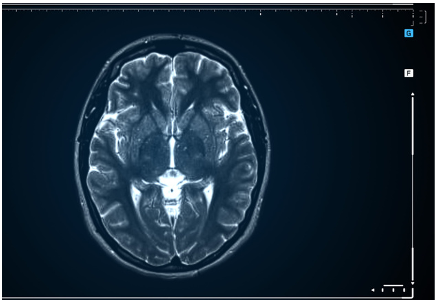

{ .col-md-4 .img-fluid .d-flex .mx-auto .align-items-center .rounded .p1 .mb-4 }

[DICOM](https://en.wikipedia.org/wiki/DICOM) is a file format and communication protocol intended to manage digital data from medical imaging ([PACS](https://en.wikipedia.org/wiki/Picture_archiving_and_communication_system) systems).
{ .alert .alert-warning }

By embedding native compatibility with this standard, `Ugloo` becomes a _de facto_ ideal storage and archiving solution in medical environments such as hospitals or imaging centers.
