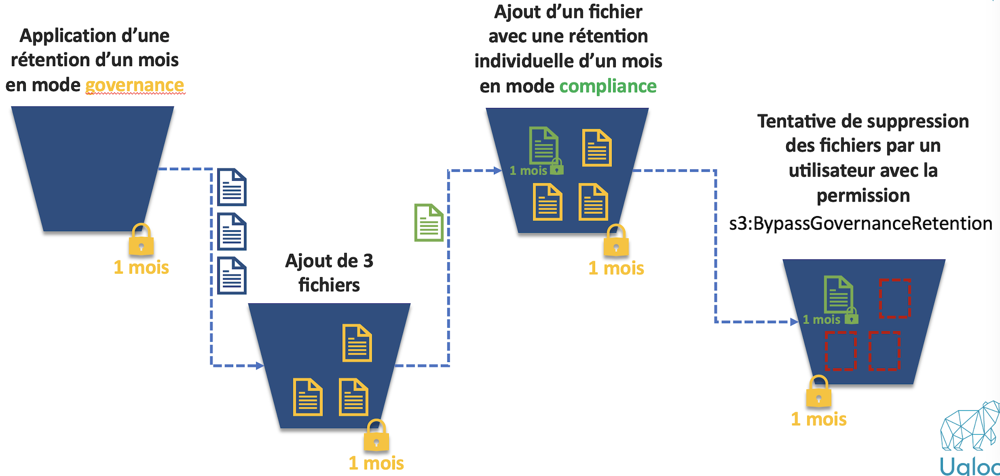

{ .col-md-8 .img-fluid .d-flex .mx-auto .align-items-center .rounded .p1 .mb-4 }

Based on a _fork_ of [MinIO](https://min.io/), `Ugloo` is fully compatible with the _API_ of `AWS S3`.  
`Ugloo` can therefore be used as the storage for any application using S3 object storage.
{ .alert .alert-warning }

#### Elastic

`Ugloo` takes full advantage of the elastic storage capabilities natively provided by object storage technology.  
In detail, it presents [the same limits of the S3 API as MinIO](https://github.com/minio/minio/blob/master/docs/minio-limits.md#limits-of-s3-api ).

* max objects per _bucket_ : unlimited
* max size of an object : 5 TB
* max size of a multi-part object : 50 TB

#### Versions management and lifecycle

`Ugloo` natively handles multiple (immutable) versions of the same `S3` object.  
For a given object, we can therefore access/delete a specific version, and manage the configuration of an expiration time for each specific version.
`Ugloo` supports native `S3` _locks_ to set up regulatory retention periods.

{ .col-md-10 .img-fluid .d-flex .mx-auto .align-items-center .rounded .p1 .mb-4 }
