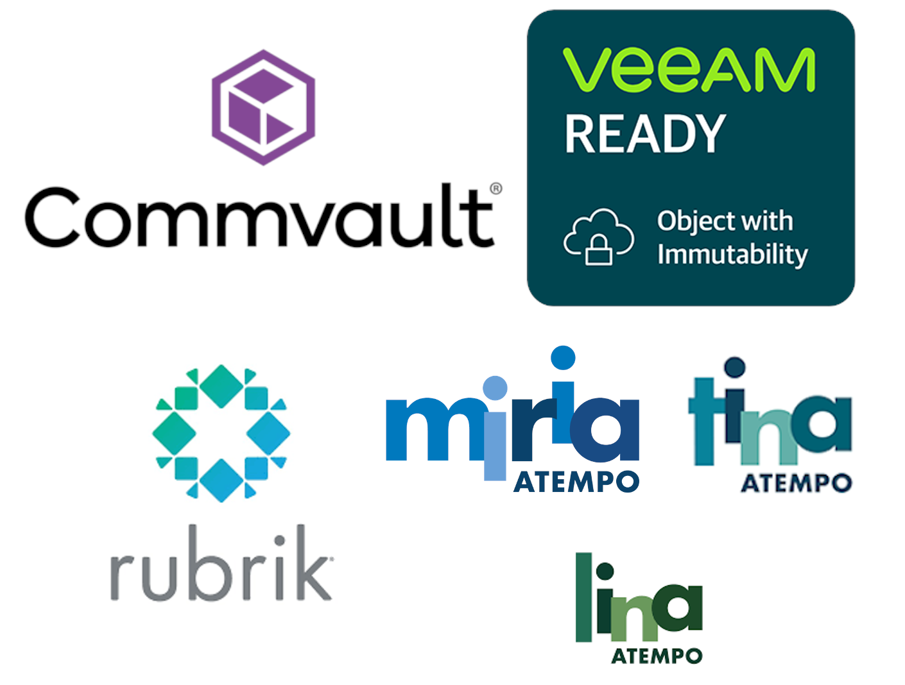

{ .col-md-8 .img-fluid .d-flex .mx-auto .align-items-center .rounded .p1 .mb-4 }

Since `Ugloo` is compatible with the `AWS S3` _API_, it can serve as a storage _backend_ for the main backup and archiving software on the market.  
In 2023, `Ugloo` qualified according to the validation and certification protocols of the following solutions…
{ .alert .alert-warning }

# Veeam integration

* [Veeam Object Repository](https://helpcenter.veeam.com/docs/backup/vsphere/object_storage_repository.html?ver=120), compatible avec [Veeam SOSAPI](https://helpcenter.veeam.com/docs/backup/vsphere/sosapi.html?ver=120)

<iframe width="560" height="315" src="https://www.youtube.com/embed/skXc9TyjRww?si=3Q33XKW3Lokv4K7a" title="YouTube video player" frameborder="0" allow="accelerometer; autoplay; clipboard-write; encrypted-media; gyroscope; picture-in-picture; web-share" referrerpolicy="strict-origin-when-cross-origin" allowfullscreen></iframe>

<iframe width="560" height="315" src="https://www.youtube.com/embed/rIkEwIuhJz8?si=rg0Eycr8zbsSTtE7" title="YouTube video player" frameborder="0" allow="accelerometer; autoplay; clipboard-write; encrypted-media; gyroscope; picture-in-picture; web-share" referrerpolicy="strict-origin-when-cross-origin" allowfullscreen></iframe>

<iframe width="560" height="315" src="https://www.youtube.com/embed/PiDpp6vRgkE?si=BeIUDu31PosU4DNu" title="YouTube video player" frameborder="0" allow="accelerometer; autoplay; clipboard-write; encrypted-media; gyroscope; picture-in-picture; web-share" referrerpolicy="strict-origin-when-cross-origin" allowfullscreen></iframe>

<iframe width="560" height="315" src="https://www.youtube.com/embed/EpFeAsRSDQY?si=tmuYmmCXvA4Ck84Y" title="YouTube video player" frameborder="0" allow="accelerometer; autoplay; clipboard-write; encrypted-media; gyroscope; picture-in-picture; web-share" referrerpolicy="strict-origin-when-cross-origin" allowfullscreen></iframe>

# Rubrik integration
{ .mt-4 }

* [Rubrik Archival Location](https://docs.rubrik.com/en-us/saas/saas/arch_dc_archival_location_details.html)

<iframe width="560" height="315" src="https://www.youtube.com/embed/S-jcXcLi_LY?si=wFZvaIgUxL8NBrgf" title="YouTube video player" frameborder="0" allow="accelerometer; autoplay; clipboard-write; encrypted-media; gyroscope; picture-in-picture; web-share" referrerpolicy="strict-origin-when-cross-origin" allowfullscreen></iframe>

<iframe width="560" height="315" src="https://www.youtube.com/embed/-07PipuIXtc?si=cF34chWGJCW0OVtY" title="YouTube video player" frameborder="0" allow="accelerometer; autoplay; clipboard-write; encrypted-media; gyroscope; picture-in-picture; web-share" referrerpolicy="strict-origin-when-cross-origin" allowfullscreen></iframe>

<iframe width="560" height="315" src="https://www.youtube.com/embed/Q6Yac0K8bts?si=i5Y_7vYIjPNj830G" title="YouTube video player" frameborder="0" allow="accelerometer; autoplay; clipboard-write; encrypted-media; gyroscope; picture-in-picture; web-share" referrerpolicy="strict-origin-when-cross-origin" allowfullscreen></iframe>

# Atempo integration with Miria, Tina and Lina
{ .mt-4 }

* `Atempo` Repository S3, compatible with [Miria](https://www.atempo.com/products/miria-backup-and-migration-for-large-file-storages-3/), [Tina](https://www.atempo.com/products/tina-time-navigator-enterprise-solution-for-backup-and-recovery-2/) et [Lina](https://www.atempo.com/products/lina-live-navigator-backup-workstations-laptops/)

<iframe width="560" height="315" src="https://www.youtube.com/embed/ecHhm0sk_tE?si=etwUc2efDh22XjOR" title="YouTube video player" frameborder="0" allow="accelerometer; autoplay; clipboard-write; encrypted-media; gyroscope; picture-in-picture; web-share" referrerpolicy="strict-origin-when-cross-origin" allowfullscreen></iframe>

<iframe width="560" height="315" src="https://www.youtube.com/embed/6TlaLAoZgEk?si=fNNon8eYZHWey56u" title="YouTube video player" frameborder="0" allow="accelerometer; autoplay; clipboard-write; encrypted-media; gyroscope; picture-in-picture; web-share" referrerpolicy="strict-origin-when-cross-origin" allowfullscreen></iframe>

<iframe width="560" height="315" src="https://www.youtube.com/embed/K1U-YBRAgG0?si=09eWxySak7J8cW49" title="YouTube video player" frameborder="0" allow="accelerometer; autoplay; clipboard-write; encrypted-media; gyroscope; picture-in-picture; web-share" referrerpolicy="strict-origin-when-cross-origin" allowfullscreen></iframe>
