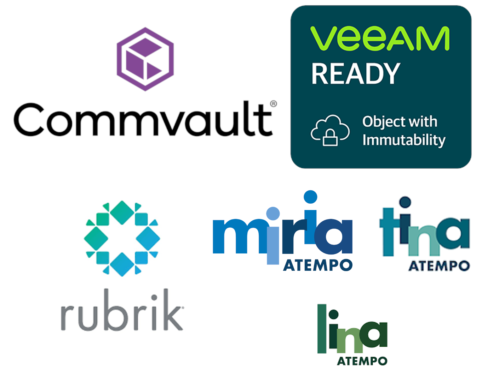

{ .col-md-8 .img-fluid .d-flex .mx-auto .align-items-center .rounded .p1 .mb-4 }

`Ugloo` étant compatible avec les _API_ d'`AWS S3`, il peut servir de _backend_ de stockage aux principales solutions de sauvegarde et d'archivage du marché.  
En 2023, `Ugloo` a été qualifié selon les protocoles de validation et de certification des solutions suivantes…
{ .alert .alert-warning }

# Intégration avec Veeam

* [Veeam Object Repository](https://helpcenter.veeam.com/docs/backup/vsphere/object_storage_repository.html?ver=120), compatible avec [Veeam SOSAPI](https://helpcenter.veeam.com/docs/backup/vsphere/sosapi.html?ver=120)

<iframe width="560" height="315" src="https://www.youtube.com/embed/skXc9TyjRww?si=3Q33XKW3Lokv4K7a" title="YouTube video player" frameborder="0" allow="accelerometer; autoplay; clipboard-write; encrypted-media; gyroscope; picture-in-picture; web-share" referrerpolicy="strict-origin-when-cross-origin" allowfullscreen></iframe>

<iframe width="560" height="315" src="https://www.youtube.com/embed/rIkEwIuhJz8?si=rg0Eycr8zbsSTtE7" title="YouTube video player" frameborder="0" allow="accelerometer; autoplay; clipboard-write; encrypted-media; gyroscope; picture-in-picture; web-share" referrerpolicy="strict-origin-when-cross-origin" allowfullscreen></iframe>

<iframe width="560" height="315" src="https://www.youtube.com/embed/PiDpp6vRgkE?si=BeIUDu31PosU4DNu" title="YouTube video player" frameborder="0" allow="accelerometer; autoplay; clipboard-write; encrypted-media; gyroscope; picture-in-picture; web-share" referrerpolicy="strict-origin-when-cross-origin" allowfullscreen></iframe>

<iframe width="560" height="315" src="https://www.youtube.com/embed/EpFeAsRSDQY?si=tmuYmmCXvA4Ck84Y" title="YouTube video player" frameborder="0" allow="accelerometer; autoplay; clipboard-write; encrypted-media; gyroscope; picture-in-picture; web-share" referrerpolicy="strict-origin-when-cross-origin" allowfullscreen></iframe>

# Intégration avec Rubrik
{ .mt-4 }

* [Rubrik Archival Location](https://docs.rubrik.com/en-us/saas/saas/arch_dc_archival_location_details.html)

<iframe width="560" height="315" src="https://www.youtube.com/embed/S-jcXcLi_LY?si=wFZvaIgUxL8NBrgf" title="YouTube video player" frameborder="0" allow="accelerometer; autoplay; clipboard-write; encrypted-media; gyroscope; picture-in-picture; web-share" referrerpolicy="strict-origin-when-cross-origin" allowfullscreen></iframe>

<iframe width="560" height="315" src="https://www.youtube.com/embed/-07PipuIXtc?si=cF34chWGJCW0OVtY" title="YouTube video player" frameborder="0" allow="accelerometer; autoplay; clipboard-write; encrypted-media; gyroscope; picture-in-picture; web-share" referrerpolicy="strict-origin-when-cross-origin" allowfullscreen></iframe>

<iframe width="560" height="315" src="https://www.youtube.com/embed/Q6Yac0K8bts?si=i5Y_7vYIjPNj830G" title="YouTube video player" frameborder="0" allow="accelerometer; autoplay; clipboard-write; encrypted-media; gyroscope; picture-in-picture; web-share" referrerpolicy="strict-origin-when-cross-origin" allowfullscreen></iframe>

# Intégration avec Atempo Miria, Tina et Lina
{ .mt-4 }

* `Atempo` Repository S3, compatible avec [Miria](https://www.atempo.com/fr/produits/miria-sauvegarde-et-migration-de-stockages-de-fichiers-de-grands-volumes/), [Tina](https://www.atempo.com/fr/produits/tina-atempo-time-navigator-sauvegarde-d-entreprise-complete/) et [Lina](https://www.atempo.com/fr/produits/lina-sauvegarde-des-postes-fixes-et-portables-2/)

<iframe width="560" height="315" src="https://www.youtube.com/embed/ecHhm0sk_tE?si=etwUc2efDh22XjOR" title="YouTube video player" frameborder="0" allow="accelerometer; autoplay; clipboard-write; encrypted-media; gyroscope; picture-in-picture; web-share" referrerpolicy="strict-origin-when-cross-origin" allowfullscreen></iframe>

<iframe width="560" height="315" src="https://www.youtube.com/embed/6TlaLAoZgEk?si=fNNon8eYZHWey56u" title="YouTube video player" frameborder="0" allow="accelerometer; autoplay; clipboard-write; encrypted-media; gyroscope; picture-in-picture; web-share" referrerpolicy="strict-origin-when-cross-origin" allowfullscreen></iframe>

<iframe width="560" height="315" src="https://www.youtube.com/embed/K1U-YBRAgG0?si=09eWxySak7J8cW49" title="YouTube video player" frameborder="0" allow="accelerometer; autoplay; clipboard-write; encrypted-media; gyroscope; picture-in-picture; web-share" referrerpolicy="strict-origin-when-cross-origin" allowfullscreen></iframe>
