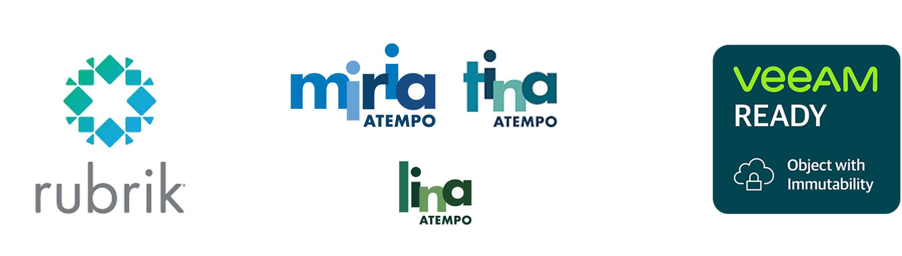

{ .col-md-8 .img-fluid .d-flex .mx-auto .align-items-center .rounded .p1 }

`Ugloo` étant compatible avec les _API_ d'`AWS S3`, il peut servir de _backend_ de stockage aux principales solutions de sauvegarde et d'archivage du marché.
{ .alert .alert-warning }

En 2023, `Ugloo` a été qualifié selon les protocoles de validation et de certification des solutions suivantes :
* [Rubrik Archival Location](https://docs.rubrik.com/en-us/saas/saas/arch_dc_archival_location_details.html)
* `Atempo` Repository S3, compatible avec [Miria](https://www.atempo.com/fr/produits/miria-sauvegarde-et-migration-de-stockages-de-fichiers-de-grands-volumes/), [Tina](https://www.atempo.com/fr/produits/tina-atempo-time-navigator-sauvegarde-d-entreprise-complete/) et [Lina](https://www.atempo.com/fr/produits/lina-sauvegarde-des-postes-fixes-et-portables-2/)
* [Veeam Object Repository](https://helpcenter.veeam.com/docs/backup/vsphere/object_storage_repository.html?ver=120), compatible avec [Veeam SOSAPI](https://helpcenter.veeam.com/docs/backup/vsphere/sosapi.html?ver=120)