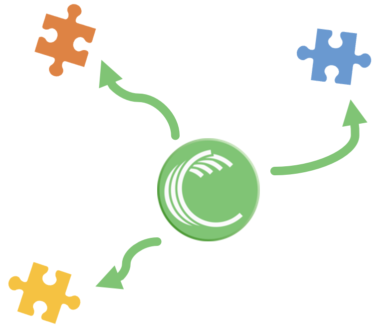

{ .col-md-4 .img-fluid .d-flex .mx-auto .align-items-center .rounded .p1 .mb-4 }

Stemming from university research work, `Ugloo` developed `DeepTorrent`™  
a patented **distributed, decentralized and immutable storage** technology, extension of the `BitTorrent` protocol.
{ .alert .alert-warning }

# Distributed

{ .col-md-2 .img-fluid .d-flex .mx-auto .align-items-center .rounded .p1 }

With its **patented** `DeepTorrent`™ technology, `Ugloo` decentralizes the whole storage of your data whatever the topology of your infrastructures.​  
`DeepTorrent` is an extension of the `BitTorrent` protocol, to meet the specific needs of `Ugloo`.

`BitTorrent` protocol is _OpenSource_. It remains the solution with the largest network of storage nodes in the world.
{ .alert .alert-warning }

`BitTorrent` is a _peer-to-peer_ file storage protocol, which allows the storage, sharing and distribution of large files by requesting peers who have a copy of said files (all or parts).  
The identification of these peers is done dynamically.

# Resilient

{ .col-md-2 .img-fluid .d-flex .mx-auto .align-items-center .rounded .p1 .mb-4 }

After encryption, each `S3` object is divided into up to 255 fragments. These fragments are scattered across all the nodes available on the _cluster_.​  
_Erasure Coding_ is a data protection method that divides data into fragments; developed and quantified. These contain redundant data elements and are stored on different sites or storage media. The goal is to be able to reconstruct data that was corrupted during the disk writing from information stored in other locations in the _cluster_.

Redundancy and automatic check/rebuild of fragments provide you with a **lifetime guarantee** of your data, with an **unrivaled level of security**.
{ .alert .alert-warning }

# Elastic

{ .col-md-2 .img-fluid .d-flex .mx-auto .align-items-center .rounded .p1 .mb-4 }

At any time, the capacity and performance of the _cluster_ can be reviewed (upwards or downwards) by adjusting the number of disks, the number of nodes, **without interruption of service**.  

The distribution of fragments is then done automatically, in background, **without reconfiguring the _erasure code_**.
{ .alert .alert-warning }

# Versatile

{ .col-md-2 .img-fluid .d-flex .mx-auto .align-items-center .rounded .p1 .mb-4 }

`BitTorrent` est natively designed for heterogeneous and hostile network infrastructures.  
{ .alert .alert-warning }

The `Ugloo` software components are deployed as `Docker` _containers_.  
`Ugloo` will then work whatever the topology of your infrastructures:
* installed as _appliances_ in your _datacenters_ or at your hosters,
* deployed as _containers_, on your physical servers, your _VMs_, in your _Kubernetes_ _clusters_, or on your public _Cloud_ infrastructure,
* hosted on a single/several sites, or even several regions,
* in hybrid and/or multi-supplier setups
  