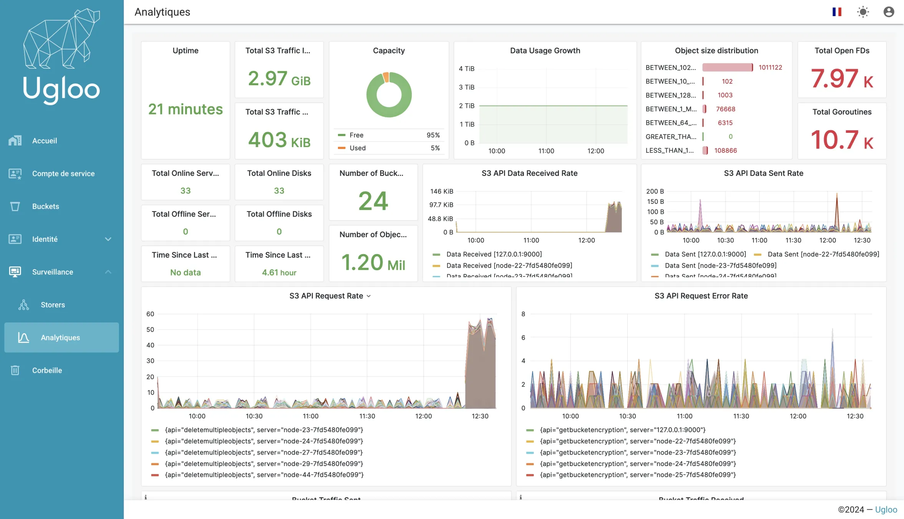

{ .col-md-8 .img-fluid .d-flex .mx-auto .align-items-center .rounded .p1 .mb-4 }

`Ugloo` a considérablement renforcé son harnais d'observabilité au 1er trimestre 2024.  
Pour offrir la meilleure visibilité et permettre la meilleure gestion de l'activité de la solution.
{ .alert .alert-warning }

## Métriques et alertes

{ .col-md-2 .img-fluid .d-flex .mx-auto .align-items-center .rounded .p1 .mb-4 }

- Métriques sur le _cluster_ et ses opérations
- Représentation graphique de ces métriques
- Utilisation du modèle de données `Prometheus` pour des analyses historiques
- Possibilité d'intégration avec divers outils de surveillance tiers
- Paramétrage d’alertes sur les différentes métriques disponibles. 

## Journalisation

{ .col-md-2 .img-fluid .d-flex .mx-auto .align-items-center .rounded .p1 .mb-4 }

- Journalisation des évènements `S3` pour chaque _tenant_.
- Prise en charge de la publication des journaux serveur et d'audit vers un _Webhook_
- Les journaux d'audit offrent une vue granulaire des opérations, répondant aux exigences de sécurité et de conformité.

## Contrôle de santé

{ .col-md-2 .img-fluid .d-flex .mx-auto .align-items-center .rounded .p1 .mb-4 }

- Sonde permanente renvoyant un code d’état simplifiant les vérifications de santé des nœuds et la haute disponibilité du cluster.
- Facilité d'utilisation de l'_API_ de contrôle de santé pour surveiller la stabilité du _cluster_.
