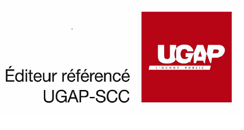

{ .col-md-8 .img-fluid .d-flex .mx-auto .align-items-center .rounded .p1 .mb-4 }

Versatile when used, `Ugloo` also uses versatile marketing methods.
{ .alert .alert-warning }

## 100% indirect sale

The marketing model of `Ugloo` is **100% indirect**, meaning that we systematically go through resellers/integrators, _CSP_ or _MSP_, who are seasoned and trained to support you and optimize the architecture of the solution chosen to meet your needs.

## White label sales

`Ugloo` can be sold as a white label.  
For this usage, `Ugloo` has [particularly useful features](../csp-ready) such as:

- multiple _tenants_ management,
- the management interface may be configured in the colors of your company,
- or even metrics allowing you to build your own invoicing model.

## Pricing in subscription mode (OPEX) or in acquisition mode (CAPEX)

In order to best match the needs of your business, `Ugloo` can be sold:

- in monthly **subscription** (**_OPEX_**) mode, which includes the cost of licenses, support and updates;
- or in **acquisition** mode (**_CAPEX_**), where the customer purchases the `Ugloo` software and maintenance including the first year.

(Support: every working day from 9:00 a.m. to 7:00 p.m.).

## UGAP-SCC listed vendor (for administration customers)

{ .col-md-4 .img-fluid .d-flex .mx-auto .align-items-center .rounded .p1 }

The company `Ugloo` is listed as a vendor on the **UGAP** market of [SCC](https://france.scc.com/), in order to facilitate its acquisition by all stakeholders in administration.
