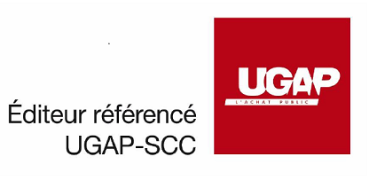

{ .col-md-8 .img-fluid .d-flex .mx-auto .align-items-center .rounded .p1 .mb-4 }

Versatile dans ses utilisations, Ugloo l'est aussi dans ses modes de commercialisation.
{ .alert .alert-warning }

## Vente 100% indirecte

Le modèle de commercialisation de la solution `Ugloo` est **100% indirect**, c’est-à-dire que nous passons systématiquement par des revendeurs/intégrateurs, _CSP_ ou _MSP_, qui sont aguerris et formés pour vous accompagner et optimiser l'architecture de la solution retenue pour répondre à votre besoin.

## Possibilité de vente en marque blanche

`Ugloo` peut être vendu en marque blanche.  
Pour cet usage, `Ugloo` dispose de [fonctionnalités particulièrement utiles](../csp-ready) comme :

- la gestion de multiples _tenants_,
- la possibilité de configurer l'interface de gestion aux couleurs de votre société,
- ou encore des métriques permettant de construire votre propre modèle de refacturation.

## Tarification en mode souscription (OPEX) ou en mode acquisition (CAPEX)

Afin de s'adapter au mieux aux besoins de votre entreprise, `Ugloo` peut être vendu :

- en mode **souscription** (**_OPEX_**) mensuelle, qui inclut le coût des licences, le support et les mises à jour ;
- ou en mode **acquisition** (**_CAPEX_**), où le client achète le logiciel `Ugloo` et la maintenance y compris la première année.

(Support : tous les jours ouvrés de 9h00 à 19h00).

## Référencé à l'UGAP (pour secteur public)

{ .col-md-4 .img-fluid .d-flex .mx-auto .align-items-center .rounded .p1 }

La société `Ugloo` est référencée au marché de l'**UGAP** de [SCC](https://france.scc.com/), afin de faciliter son acquisition par tous les acteurs du secteur public.  