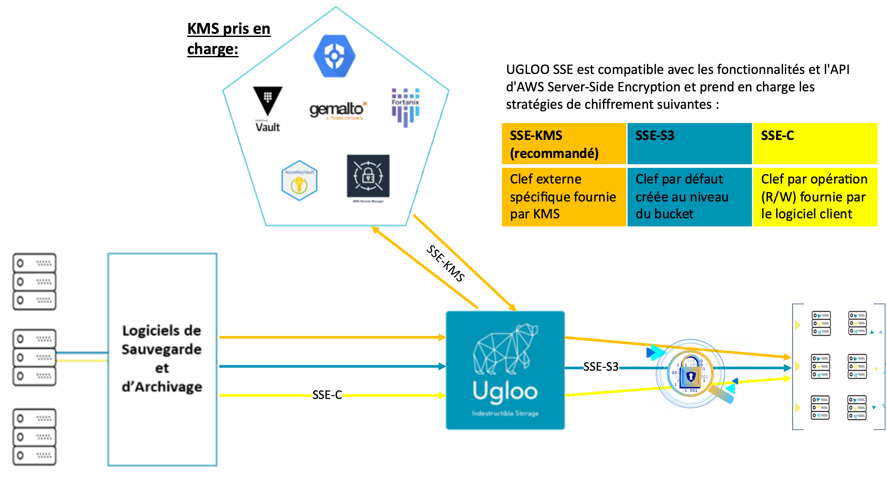
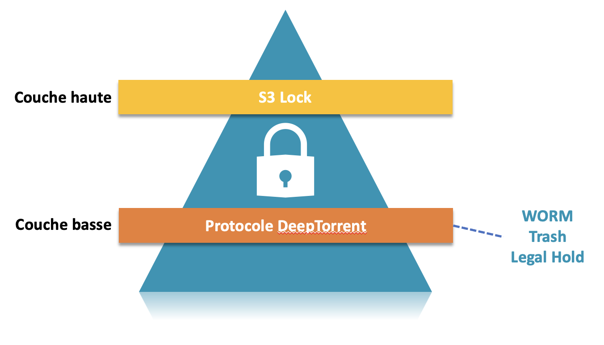

{ .col-md-6 .img-fluid .d-flex .mx-auto .align-items-center .rounded .p1 .mb-4 }

Ugloo offers **indestructible storage**:  
resilient, multi-site, encrypted, decentralized and immutable.
{ .alert .alert-warning }

# Data encryption

`Ugloo` implements state-of-the-art data encryption.

## Transit encrpytion

* Connexion _TLS_ connection between client and `S3` gateway.
  * using self-signed certificate or one delivered by the customer.

## _At-rest_ and _cluster-wide_ transit encryptions

Data is encrypted when its written in the _cluster_.  
`UGLOO SSE` is compatible with **AWS** `Server-Side Encryption` features and _API_ and supports the following encryption policies:
* `SSE-KMS`, where the dedicated key is delivered by a _KMS_
  * internal _PKI_ is available in your `Ugloo` _cluster_
  * you may use your favorite external _Key Management System_
    * HashiCorp Vault
    * Azure Key Vault, AWS Key Secure Manager, Google Cloud KMS
    * Fortanix Data Security Manager
    * Gemalto SafeNet KeySecure
* `SSE-S3`, where a default key is generated for encryption in each bucket
* `SSE-SC`, where a key is delivered by the customer for each and every operations on an object (erad/write).

{ .col-md-10 .img-fluid .d-flex .mx-auto .align-items-center .rounded .p1 }

# Double immutability

_Cryptolocking ransomware_ is no match for the data stored in `Ugloo`. Each version of an object has double immutability:
* at the `S3` object configuration level through [the _lock_ modes and the retention periods.](#version-management-and-life-cycle)
* at the `DeepTorrent` fragments level, which are natively immutable
  * with configurable regulatory retention period
  * and recoverable trash

{ .col-md-8 .img-fluid .d-flex .mx-auto .align-items-center .rounded .p1 }

# Security audit on BitTorrent protocol

`Ugloo` relies on [libtorrent](https://www.libtorrent.org/) _open source_ library. Onto which a [security audit has been performed at the end of 2020](https://www.libtorrent.org/security-audit.html), ordered by [Mozilla Open Source Support Awards](https://www.mozilla.org/en-US/moss/) et performed by [include security](https://IncludeSecurity.com/).

{ .col-md-6 .img-fluid .d-flex .mx-auto .align-items-center .rounded .p1 }
